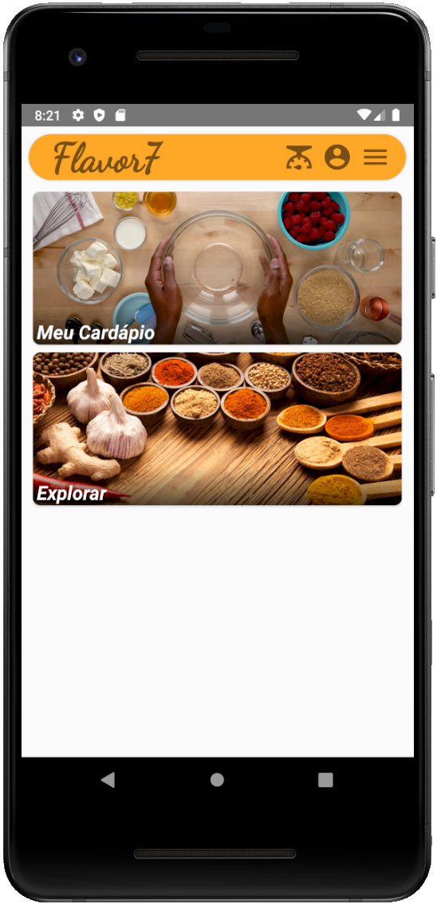

# Flavor7
App para simplificar as escolhas alimentares para pessoas com restrições (celíacos, veganos, etc.)

# Sobre a implementação
- Implementação baseada em MVVM
- Uma activity, um gerenciador de navegação colocando fragments em frames

# Sobre a usabilidade
- Oferece ao usuário a possibilidade de selecionar quais grupos de aliementos e/ou dietas são relevantes
- Cria cardápios semanais baseados nesses filtros, a partir de um banco de dados de receitas e ingredientes pré-classificados
- Permite que o usuário salve e agrupe suas receitas favoritas para consulta posterior (Livros de receitas). Os livros podem ser públicos ou privados
- Permite que um usuário siga os livros de receitas públicos de outros usuários
- Configurações e livros do usuário salvos no servidor
- Comentários em receitas, like/dislike em receitas e comentários e apresentação de comentários ordenados cronologicamente ou por popularidade
- Display semanal ("Spotlight") de receitas mais populares

# Screenshots

